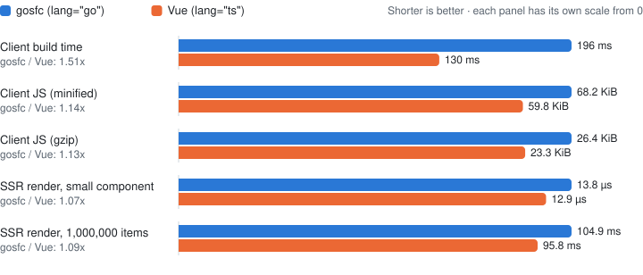

# gosfc

[English](README.md) | 日本語

[](ARCHITECTURE.ja.md)
[](LICENSE)
[](https://go.dev/)
[](https://vuejs.org/)
[](https://vite.dev/)
[](https://astro.build/)
[](https://github.com/goesm-dev/goesm)

Vue Single File Component の `<script setup>` と、`.astro` ファイルのフロントマターと `<script>` で本物の Go を使うための統合レイヤーです。

```vue
<template>
  <div>
    合計: {{ total }}
  </div>
</template>

<script setup lang="go">
import cart "example.com/app/src/features/cart/pkg"

items := []cart.Item{
	{
		Price:    100,
		Quantity: 2,
	},
}

total := cart.Total(items)
</script>
```

`.go` は普通の Go パッケージ、インポートは普通の Go のインポートです。Go のコンパイルは [goesm](https://github.com/goesm-dev/goesm)、SFC とテンプレートは Vue tooling、`.astro` のテンプレートは Astro、ビルドは Vite、ページと SSR は Astro が担当します。設計は [ARCHITECTURE.ja.md](ARCHITECTURE.ja.md) を見てください。

**状態：PoC。** 未実装の項目は ARCHITECTURE.ja.md の「未実装・未決事項」にあります。

## 使い方（Astro）

1. Go モジュールに goesm と gosfc をツールとして追加します。バージョンは go.mod / go.sum で固定されます。

   ```sh
   go get -tool github.com/goesm-dev/goesm/cmd/goesm@<version>
   go get -tool github.com/goesm-dev/gosfc/cmd/gosfc@<version>
   ```

2. Astro にインテグレーションを追加します。`@astrojs/vue` が無ければ追加されます。

   ```js
   // astro.config.mjs
   import { defineConfig } from "astro/config";
   import gosfc from "@gosfc/astro";

   export default defineConfig({
     integrations: [gosfc()],
   });
   ```

3. `.vue` で `<script setup lang="go">` を使います。

   ```astro
   ---
   import Summary from "../features/cart/Summary.vue";
   ---

   <Summary />
   ```

   `.astro` ファイルも Go で書けます。書き方は「[.astro ファイルで Go を使う](#astro-ファイルで-go-を使う)」で説明します。

Vite だけで使う場合は `@vitejs/plugin-vue` の前に `@gosfc/vite` を置きます。

```js
import vue from "@vitejs/plugin-vue";
import gosfc from "@gosfc/vite";

export default { plugins: [gosfc(), vue()] };
```

`lang="ts"` や素の `<script setup>` のコンポーネントはそのまま共存できます。gosfc が触るのは `lang="go"` のコンポーネントだけです。

## Go ブロックの書き方

* トップレベルは Vue の `<script setup>` と同じくコンポーネントインスタンスごとに上から 1 回実行されます。`x := ...`、`var`、`const`、`type`、`func F() {...}` が書けます。
* トップレベルの変数・定数・関数はテンプレートから参照できます。Go 関数をテンプレートから呼ぶ（`@click="Increment"` など）と、表示が Go の値に追従します。
* インポートは Go のインポートだけです。`.vue`、`.ts`、`.go` ファイルのインポートはできません。`.astro` ファイルの Go のフロントマターは JavaScript のモジュールもインポートできます。
* メソッドとジェネリック関数は Go パッケージに置いてください。
* props を受け取るには `type Props struct {...}` を宣言します。ブロックの中でその型の `props` 変数が使えます。フィールド `Route` は属性 `route`（json タグがあればその名前、または kebab-case の形）から読み、フィールドの型（string、bool、整数、浮動小数点数）に変換します。props はインスタンスの setup 時に 1 回だけ読み、ルート要素にはフォールスルーしません。

  ```vue
  <script setup lang="go">
  import "strings"

  type Props struct {
  	Title string
  }

  heading := strings.ToUpper(props.Title)
  </script>
  ```

## .astro ファイルで Go を使う

フロントマターを `---` ではなく `---go` で始めると、その中身は Go になります。規則は `.vue` の Go ブロックと同じです。トップレベルはレンダリングごとに 1 回実行されます。静的ビルドではビルド時、SSR ではリクエストごとの実行です。トップレベルの変数・定数・関数はテンプレートから参照できます。

```astro
---go
import (
	"strconv"

	cart "example.com/app/src/features/cart/pkg"
	Line "../features/cart/Line.astro"
	Summary "../features/cart/Summary.vue"
)

items := []cart.Item{
	{Price: 120, Quantity: 3},
	{Price: 80, Quantity: 1},
}
total := cart.Total(items)

func Yen(n int) string {
	return "¥" + strconv.Itoa(n)
}
---

<Line label="りんご" price={120} quantity={3} />
<p>合計: {Yen(total)}、{items.length} 品目</p>
<Summary />
```

* コンポーネントやスタイル、npm パッケージなどの JavaScript のモジュールは Go のインポート構文でインポートします。`import Card "./Card.vue"` は `import Card from "./Card.vue"` と同じ意味になり、`import _ "./global.css"` は副作用のためのインポートになります。インポートパスが `./`、`../`、`/`、`@` で始まるか `:` を含む場合は JavaScript のモジュールとして扱います。`astro:assets` も JavaScript のモジュールです。それ以外のパスは Go のパッケージです。
* `type Props struct {...}` を宣言すると `Astro.props` を受け取れます。フィールド名と props の名前の対応は `.vue` の Go ブロックと同じで、フィールド `Label` は `label` から読みます。
* テンプレートに渡る値は JavaScript 向けに変換されます。文字列は JavaScript の文字列、スライスは配列、struct はオブジェクトになります。テンプレートから Go の関数を呼ぶこともできます。
* チャネルや `time.Sleep` などで Go のコードがブロックする場合、フロントマターはその完了を待ちます。

テンプレートの中の `<script lang="go">` は、ブラウザでページごとに 1 回実行される Go です。Astro が処理する通常の `<script>` と同じように Astro がバンドルし、コンポーネントを何度使ってもページに含まれるのは 1 回だけです。トップレベルの名前はテンプレートから参照できません。DOM の操作には `syscall/js` を使います。

```astro
<button id="counter">0</button>

<script lang="go">
import (
	"strconv"
	"syscall/js"
)

count := 0
button := js.Global().Get("document").Call("getElementById", "counter")
button.Call("addEventListener", "click", js.FuncOf(func(this js.Value, args []js.Value) any {
	count++
	button.Set("textContent", strconv.Itoa(count))
	return nil
}))
</script>
```

制限は次のとおりです。

* Go のフロントマターは何もエクスポートできません。`getStaticPaths` などのエクスポートには TypeScript のフロントマターが必要です。TypeScript のフロントマターからも、次の節で説明する `go:` specifier で Go をインポートできます。
* Go のコードから使える `Astro` グローバルの情報は props だけです。`Astro.url`、`Astro.cookies`、リダイレクトなどを使うには TypeScript のフロントマターを書きます。
* Go のインポート構文で書けるのは default インポートと副作用のためのインポートだけです。JavaScript のモジュールの名前付きエクスポートを使うには、それを default エクスポートとして再エクスポートする小さなモジュールを作り、そのモジュールをインポートします。
* `<script lang="go">` には他の属性を付けられません。`is:inline` や `define:vars` も使えません。

## JavaScript から Go をインポートする

Go モジュールの中にある `.js`、`.ts`、`.astro` のモジュールは、`go:` specifier で Go パッケージを直接インポートできます。gosfc はインポートした側のファイルが属する Go モジュールで goesm を使ってそのパッケージをコンパイルし、Vite が他のモジュールと同じようにバンドルします。API は goesm のものです：エクスポートされた関数と型があり、Go の文字列やスライスは各モジュールが `$runtime` として再エクスポートするランタイムで変換します。

```astro
---
// src/pages/[slug].astro
import { Slugs, $runtime as rt } from "go:example.com/app/content";

export function getStaticPaths() {
  return rt.toArray(Slugs()).map((s) => ({ params: { slug: rt.toJSString(s) } }));
}
---
```

## ベンチマーク

同じコンポーネントを `<script setup lang="go">` と `<script setup lang="ts">` で書いて比べています（[bench/](bench)）。どちらも Vite 8 と `@vitejs/plugin-vue` でビルドし、Go 側は前に `@gosfc/vite` を置く以外は同じ設定です。

<picture>
  <source media="(prefers-color-scheme: dark)" srcset="bench/results-dark.svg">
  
</picture>

| | gosfc (`lang="go"`) | Vue (`lang="ts"`) | ratio |
|---|---:|---:|---:|
| Client build time | 196 ms | 130 ms | 1.51x |
| Client JS (minified) | 68.2 KiB | 59.8 KiB | 1.14x |
| Client JS (gzip) | 26.4 KiB | 23.3 KiB | 1.13x |
| SSR render, small component | 13.8 µs | 12.9 µs | 1.07x |
| SSR render, 1,000,000 items | 104.9 ms | 95.8 ms | 1.09x |

* **Client build time**：カウンターとカートのサマリーを置いたページの `vite build`。それぞれウォームアップのビルドを 1 回してから、先にビルドする側を入れ替えながら 9 回測った中央値です。goesm のバイナリと go コマンドのビルドキャッシュは温まった状態で、編集してビルドし直すときと同じ条件です。
* **Client JS**：そのビルドの JS ファイルすべて（Vue のランタイムを含む）。差（+8.4 KiB、gzip で +3.1 KiB）は goesm のランタイムと Go の意味論を守るためのコードです。
* **SSR render**：プロダクションの SSR ビルドで `renderToString` した時間で、両者は同じ HTML を出力します。それぞれの側とコンポーネントごとに新しい Node プロセスで、順番を入れ替えながら 5 回測った中央値です。「small component」は 3 品のカートのサマリー、「1,000,000 items」はコンポーネントの setup で 1,000,000 品を作って合計するもので、どちらも時間の大半はメモリ確保です。そこでの小さな差は、goesm が Go の意味論を守るために生成するコード（たとえば `range` での struct の値コピー）によるものと思われますが、プロファイルはまだ取っていません。

2026-10-04 に `pnpm bench` で測りました。`mise.toml` のバージョン（Node.js 26.10.0、Go 1.27.1）と goesm 20dbf1d を使い、4 vCPU の Intel Xeon 2.80GHz のクラウド VM で実行しています。サイズは決定的ですが、時間はこの環境では実行ごとに揺れます（6 回の実行で、比はビルドが 1.51x〜1.73x、small component が 1.02x〜1.26x、1,000,000 items が 1.09x〜1.20x でした）。

## 開発

Go、Node.js、pnpm は [mise](https://mise.jdx.dev/) で `mise.toml` のバージョンに揃えます。

```sh
mise install
pnpm install
pnpm test                      # go test ./... と tests/*.test.mjs
pnpm bench                     # bench/run.mjs：ベンチマークの表を出力し、bench/results-*.svg を書き直す
cd examples/astro && pnpm build   # dist/index.html に「合計: 200」、dist/go/index.html は src/pages/go.astro
cd examples/astro && pnpm dev
```

ブラウザでの HMR テストは `/opt/pw-browsers/chromium`（または `CHROMIUM` 環境変数）の Chromium を使い、無ければスキップします。

## コントリビューション / ライセンス

コントリビューションの方法と設計原則は [CONTRIBUTING.ja.md](CONTRIBUTING.ja.md) を見てください。gosfc は [MIT License](LICENSE) で公開されています。
